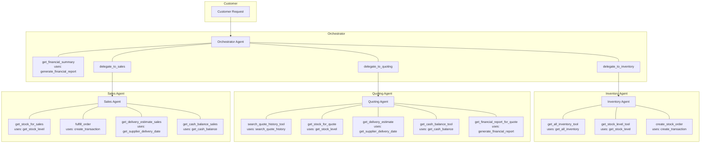

# Beaver's Choice Paper Company – Multi-Agent Workflow Diagram

## Architecture (max 5 agents)

## Data flow

1. **Customer request** (text) enters the **Orchestrator** with a request date (for DB queries).
2. Orchestrator may call **get_financial_summary** (uses `generate_financial_report`) for an overview.
3. For inventory questions or reorders → **delegate_to_inventory** → **Inventory Agent** uses:
   - `get_all_inventory`, `get_stock_level`, `create_transaction` (stock_orders).
4. For quote requests → **delegate_to_quoting** → **Quoting Agent** uses:
   - `search_quote_history`, `get_stock_level`, `get_supplier_delivery_date`, `get_cash_balance`, `generate_financial_report`.
5. For order fulfillment → **delegate_to_sales** → **Sales Agent** uses:
   - `get_stock_level`, `create_transaction` (sales), `get_supplier_delivery_date`, `get_cash_balance`.
6. Orchestrator returns a single, customer-facing response (with rationale, no sensitive internals).

Export this Mermaid from [Mermaid Live](https://mermaid.live) or Diagrams.net to produce `workflow_diagram.png` for submission.
